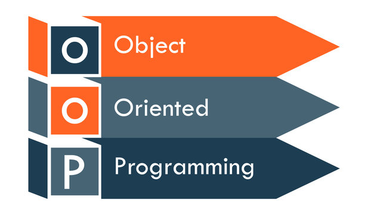
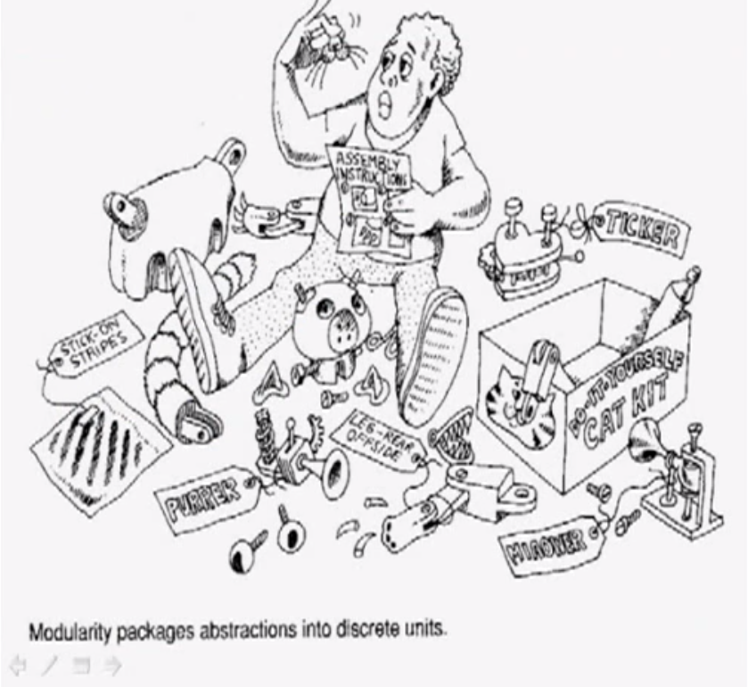
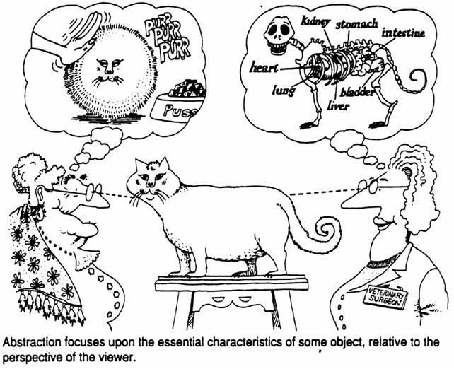
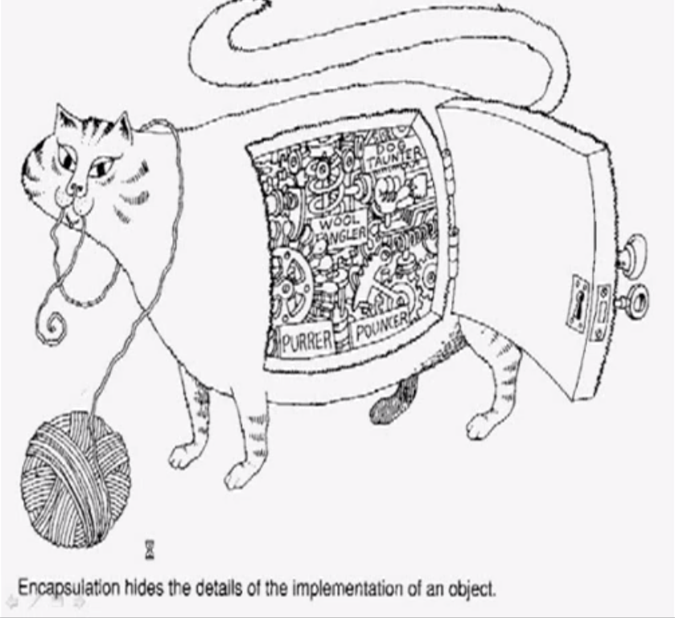
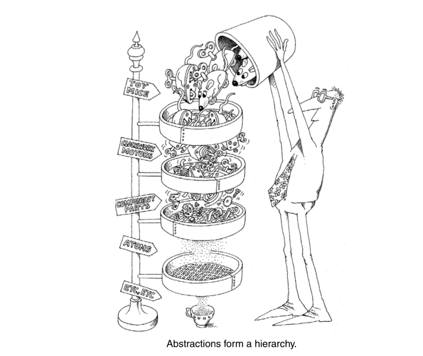

# Programación Orientada a Objetos
## Los conceptos fundamentales según Booch

**"Object Oriented Analysis and Design with Applications"** - 3ra Edición

* Entendamos qué es esto de los objetos* 🤔



---

# ¿Quién es Booch y por qué nos importa?

- **Grady Booch** - Uno de los "padres" de la OOP
- Co-creador de UML junto con Rumbaugh y Jacobson
- Su libro es **LA** referencia desde los '90s
- Define los 4 pilares conceptuales que todavía usamos hoy

*"La complejidad es el enemigo número uno del software"* - Booch

---

# El Problema que Resuelve OOP

Según Booch, el software tiene **complejidad inherente**:

- 📊 *Complejidad del dominio del problema*
- 🔧 *Dificultad de gestionar el proceso de desarrollo*
- 🔄 *Flexibilidad para cambios continuos*
- ⚡ *Problemas de caracterización del comportamiento*

**La OOP organiza esta complejidad de manera natural**



---

# Los 4 Elementos Fundamentales de Booch

1. **🎯 Abstracción**
2. **📦 Encapsulamiento**
3. **🧬 Herencia**
4. **🔄 Polimorfismo**

*"Estos elementos no son independientes; trabajan en sinergia"*

---

# 1. Abstracción
## *"Las características esenciales de un objeto"*

```python
# ❌ Pensamiento estructurado
def procesar_prestamo(titulo, autor, nombre_socio, fecha):
    # lógica dispersa...

# ✅ Abstracción OOP
class Libro:
    def prestar_a(self, socio):
        # comportamiento cohesivo
```

**Booch**: *"La abstracción enfoca las características esenciales e ignora los detalles irrelevantes"*

---




---

# 2. Encapsulamiento
## *"Ocultar los detalles de implementación"*

```python
class CuentaBancaria:
    def __init__(self):
        self._saldo = 0  # ¡Nadie toca esto directamente!

    def depositar(self, monto):
        if monto > 0:
            self._saldo += monto

    def get_saldo(self):
        return self._saldo
```

**Booch**: *"El encapsulamiento es el proceso de ocultar todos los detalles de un objeto que no contribuyen a sus características esenciales"*

---



---

# 3. Herencia
## *"Organizar las abstracciones en jerarquías"*



```python
class Vehiculo:
    def acelerar(self): pass

class Auto(Vehiculo):      # "Es-un" Vehiculo
    def abrir_baul(self): pass

class Moto(Vehiculo):      # "Es-un" Vehiculo
    def hacer_caballito(self): pass
```

**Booch**: *"La herencia es una relación entre clases donde una clase comparte la estructura y/o comportamiento definido en una o más clases"*

---

# 4. Polimorfismo
## *"Una interfaz, múltiples formas"*

```python
def hacer_sonido(animales):
    for animal in animales:
        animal.hacer_sonido()  # ¡Mismo método, comportamientos distintos!

perros = [Perro(), Gato(), Vaca()]
hacer_sonido(perros)
# "Guau", "Miau", "Muuu"
```

**Booch**: *"El polimorfismo es la propiedad por la cual las operaciones pueden comportarse diferente en clases distintas"*

---

# El Paradigma Mental: Objetos Colaborando

Según Booch, un programa OOP es:

> *"Una simulación de alguna parte del mundo real o de un mundo imaginario"*

Los **objetos**:
- Tienen **responsabilidades** claras
- **Colaboran** enviándose mensajes
- Mantienen su **estado interno**
- Exhiben **comportamiento** coherente

---

# Ejemplo: De Estructurado a OOP

```python
# 🏚️ Estilo estructurado (lo que vimos antes)
def prestar_libro(biblioteca, socio, libro):
    biblioteca.remove(libro)
    socio.libros.append(libro)

# 🏗️ Estilo OOP (pensamiento en objetos)
class Biblioteca:
    def prestar_libro_a(self, socio, libro):
        if self.tiene_disponible(libro):
            libro.prestar_a(socio)
            self._libros_disponibles.remove(libro)
```

---

# La Magia de la Colaboración

```python
class Socio:
    def pedir_prestado(self, libro, biblioteca):
        return biblioteca.prestar_libro_a(self, libro)

class Libro:
    def prestar_a(self, socio):
        self.socio_actual = socio
        self.fecha_prestamo = date.today()

# Los objetos "hablan" entre sí
carlos.pedir_prestado(don_quijote, biblioteca_nacional)
```

**Booch**: *"Los objetos colaboran para lograr el comportamiento de la aplicación completa"*

---

# ¿Por qué Funciona Esto?

Según Booch, la OOP funciona porque:

1. **🧠 Coincide con cómo pensamos** - Naturalmente categorizamos el mundo en objetos
2. **🔧 Reutilización de software** - Las clases se pueden reusar en contextos diferentes
3. **📈 Escalabilidad** - Sistemas grandes se construyen combinando objetos pequeños
4. **🔄 Mantenibilidad** - Cambios localizados en clases específicas

---

# Los Beneficios (Promesas de Booch)

- **Reusabilidad** 📦
- **Extensibilidad** 🔧
- **Mantenibilidad** 🛠️
- **Abstracción Natural** 🎯

*"La POO no es una bala de plata, pero es la mejor herramienta que tenemos para manejar la complejidad"*

---

# Para Reflexionar...

1. ¿Cómo cambiaría nuestro código de la biblioteca usando estos conceptos?

2. ¿Qué **responsabilidades** debería tener cada objeto?

3. ¿Cómo **colaborarían** los objetos Libro, Socio y Biblioteca?

4. ¿Qué **abstracciones** podríamos crear?

---

# Próximos Pasos

- Implementar la biblioteca usando clases
- Aplicar los 4 conceptos de Booch
- Diseñar la **colaboración** entre objetos
- Pensar en **responsabilidades** bien definidas

**"El código orientado a objetos bien diseñado es como una sinfonía - cada objeto tiene su parte, pero juntos crean algo hermoso"**

---

# ¿Preguntas? 🤷‍♂️

*Vamos a debatir estos conceptos y cómo aplicarlos a nuestro código...*

**Referencia**: Booch, G. (2007). *Object Oriented Analysis and Design with Applications* (3rd ed.). Addison-Wesley
